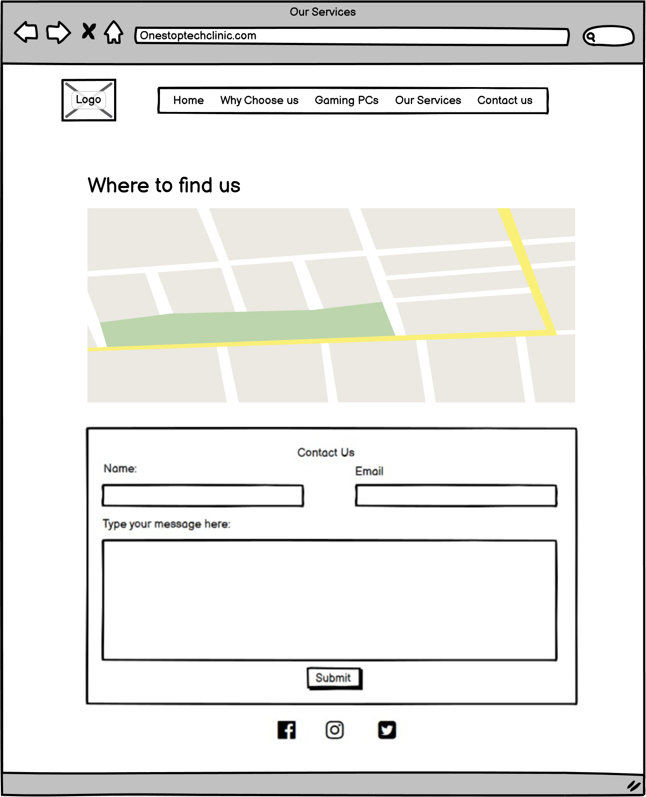
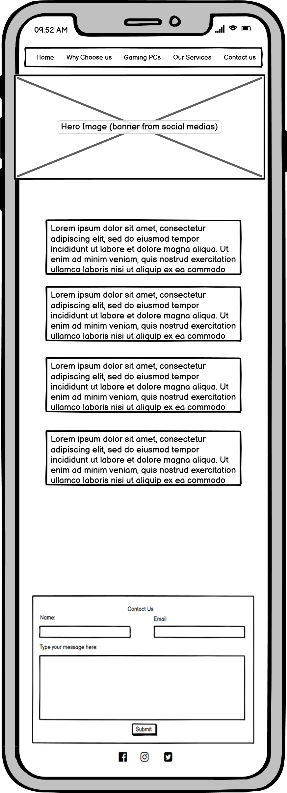
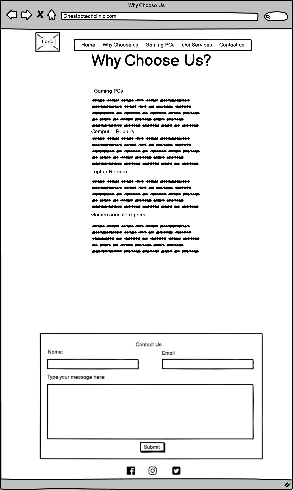
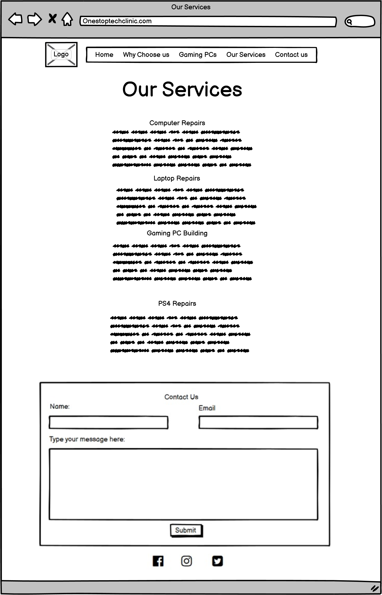
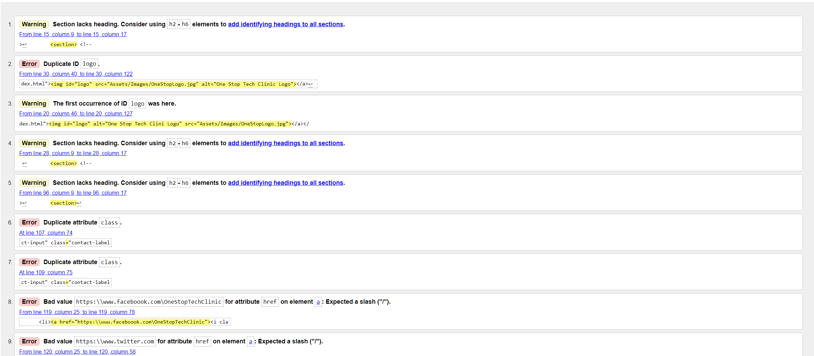
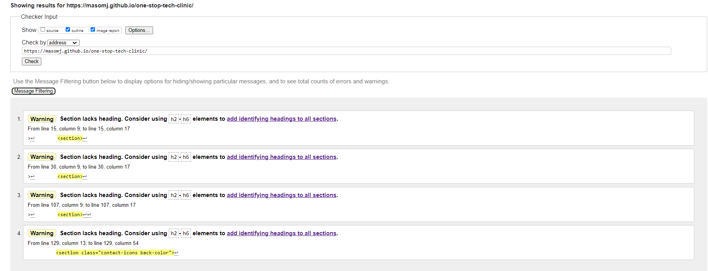

# Milestone Project One

[Am I Responsive Image](Docs/Images/AmIResponsiveTest.png)
## One Stop Tech Clinic
  - This website is going to be the main online presence of the business "One Stop Tech Clinic". It will be replacing their facebook page as thier primary focus. Therefore, it needs to be responvie and accesible accross a range of devices, operating systems and screen sizes. It's goal is to bring in new customers for the computer repair business. So it needs to contain information about services that are offered, along with how to get them.
## place the multiple screen image here
### User Experience (UX)
#### User Stories
#### First time Visitor Goals
  1. As a first time visitor, I want to be able to tell what services are offered soon after loading the website
  2. As a first time visitor, I want to be able to easily and intuitivly navigate the website
  3. As a first time visitor, I want to be able to see evidence of the business's work
  4. As a first time visitor, I want to be able to easily and intuitivly contact the business in order to request a service

#### Returning Visitor Goals
  1. As a returning visitor, I want to be able to find the businesses contact information quickly
 
#### Design Process
-  ##### Colour Scheme
   - There are 4 main colours used throughout the site. That is Red, White, Dark Blue and Aqua blue. These colours were chosen as they are bright, bold colours that contrast well with each other. The inclusion of red buttons throughout the site was done as red is the colour that attracts the human eye the most, making the user immediately want to click it, increasing site engagement. 

   - After user feedback, I made the decision to change the colour theme to a milder them, with pastel blue and beige. This brings the website in line with modern design standards. 
   
  - #### Typography
   - As this site is aimed at providing information and attracting potential customers, an attractive and readable font called was Readex Pro chosen. A backup font of Sans Serif was set to reduce the possibilty of an error resulting in the font defaulting to Times New Roman.
  - #### Imagery
   - The business already has an established social media page. So all imagery needed to be consistend with it, as some traffic may come from the social media pages. Mainly, the logo of the business, and the banner page had to be the same. The Hero image of the site is the same as the one used as a banner on the businesses facebook page. This is also true for the logo that sits in the top left corner of the Header, which also doubles as a home button. These images have releveant content and minimal, contrasting text which makes them appealing to the eye and perfect to greet a new site visitor and grab their attention.
    
### Wireframes

Wireframes

### Technologies and Tools
- HTML
- CSS 
  - I decided to use HTML and CSS as they are the most modern and widely used programming languages in website development
- VS code
  - I decided to use VS Code instead of Gitpod or another cloud based editor so I can get experience using a desktop editor
- Balsamiq
  - To create the wireframe design's for the website
- Git and Github
  - I used Git to enact version control when producing my project, whilst using GitHub as the remote repository storage tool due to it's widespread industry usage.
  - I used Git via the command line in VS Code, though there is a GUI version available from GitHub, but as the industry standard is Command line, it is important to become profficent in Command line git before using the GUI version. 
### Testing
#### Responsive Testing
- Using Chrome's built in developer tools, which can be opened by right clicking on any webpage and pressing "Inspect", I tested the sites compatability with different screen sizes. Chrome Developer tools has breakpoints for all standard screen widths for a variety of device types, like Tablets, Mobile Phones, 4K displays and Laptops. 
- In order to test the responsiveness, I viewed the site on multiple different devices, inlcuding the latest smartphones like the Google Pixel and Iphone X. The smallest screen width available to view through is 320px, so the site is optimised to 320px widths and above. 
- In order to ensure universal compatability, I tested the website on a multide of different browsers. These include: Microsoft Edge, Internet Explorer, Google Chrome, Firefox and Brave. 

#### Lighthouse Testing
 - In order to test the website's accessability (amongst other things) we use lighthouse, which is built in Chrome developer tools. Lighthouse testing of the site pointed out a small minor issues, like the alt attribute was missing from the logo image in the nav bar and the li elements for the footer wire in an incorrect order. 
 - All of the pages scored high in the tests, meaning the website adhereres to modern accesability standards. 
[Lighthouse Test Report](Docs/Images/Lighthouse Report.png)

 #### Functionality Testing
 - All clickable events in the website were tested to ensure the functionalty was as desired. Every navigation link and button was selected to ensure they directed they user to the correct place. 
 - A custom 404 page was created, which inlcudes the navigation bar, to ensure that if a user accidentally enters an incorrect address, they will be able to continue using the site.
 - Rather than using the Code Insitude form dump, which can break the experience, upon completing the contact form, a custom thank you page is displayed. The form's data checks have been tested also, to ensure that the email form will validate an email addresses format. 

 #### Bugs
 - After feedback, a decision was made to change the colour scheme. After completing this, when viewing on mobile, two 2px x 2px boxes became visible in the old colour theme, but only when viewing in mobile view. Using Dev Tools, I selected the boxes to learn what element was the source of this, and then ensured the colour was set to the new scheme. 
 - After the lighthouse testing, it was identifed that my footers needed the list elements changed around. After doing this, they no were no longer centered. The cause was the change of order meant that they were no longer selected by the css rule. Targeting them as a child of the ul resolved it.
#### Code Validation
W3 Schools offer a code validation for both HTML and CSS. I ran all of my HTML pages and all CSS code through these. 
##### Results
After Running my code throught the validator, several issues were identified. For instance, I was using an ID selector to target 2 elements, which should have been done via a class selector. This was a simple fix. 
The errors are shown in the image below. 

 Validation Tests 

After resolving all of the errors shown, I was left with advisories that stated my sections did not have h1 elements. This is because my section were used semantically and often, a heading element was not required. 
### Testing
#### User Stories Testing
##### First Time Visitor

  1. As a first time visitor, I want to be able to tell what services are offered soon after loading the website
    - This is acheived via the 4 information boxes on the home screen describing the services offered.
  2. As a first time visitor, I want to be able to easily and intuitivly navigate the website
    - The Website has a clear nagivation menu, with page titles that effectively communicate the content of that page.
  3. As a first time visitor, I want to be able to see evidence of the business's work.
    - Evidence of the Business' work can be found on the same pages as the ones depicting the services offered in more detail. 
  4. As a first time visitor, I want to be able to easily and intuitivly contact the business in order to request a service
    - The aim of the site is to get new customers. Therefore they need to be able to easily get in contact. There is a contact form at the bottom of every page that the user can       use to submit a message to the business.  

##### Returning Visitor
   1. As a returning visitor, I want to be able to find the businesses contact information quickly
    - Contacting the business is as easy as filling out the contact form in the footer, or using the social media links to navigate to the Social media site of the business to         direct message them.
  
##### Device testing
-   The Website was tested on Google Chrome, Internet Explorer, Microsoft Edge and Safari browsers.
-   The website was viewed on a variety of devices such as Desktop, Laptop, iPhone7, iPhone 8 & iPhoneX.
-   A large amount of testing was done to ensure that all pages were linking correctly.
-   Friends and family members were asked to review the site and documentation to point out any bugs and/or user experience issues. 

### Further functionality
As my skills in Javascript and other back end languages develop, I would like to implement further features such as a custom PC builder on the site, to allow users to create custom builds and provide the business with a configuration to then build. 
Additionally, I would like to implement a chat bot to speed up and increase the frequency of user interactions, with the goal of increasing custom for the business. 

### Deployment
#### Local Deployment 
In order to deploy this project locally, you will require a text editor like Visual Studio Code. 
- There are 2 ways to deploy locally. You can download the code in .zip file directly from github, or clone the repository on your machine following the steps in the next section. 

- Once the code is downloaded via either method, navigate to the directory in which it is saved, then right click the folder, and select "Open with VS Code". The whole project file will then open in VS code

- In order to make the development process easier, some VS code extensions I would reccomend installing would be "Live Server". This create a live server in VS Code, which allows you to see changes made in real time. This is extremely useful for debugging. 
#### Repository Cloning
Should you wish to work on this project, you will first needs to clone the repository. In order to do this, you can simply download the source files from github, or you can do this with GitBash. The steps below are for the GitBash process.
1. Navigate to the landing page of the repository you would like to clone.
2. Navigate to the Code section, and then copy the URL.
3. Open GitBash and type " Git Clone $Enter URL here$"

#### Remote Deployment
This Website was deployed using github Pages. I own a domain name for this site, but to use that required calling the domain providers to chane DNS settings, which I deemed not nessacary. To deploy a site to GitHub Pages, follow these steps.
1. Navigate to the repostiory you would like to publish.
2. Select "settings", then select the "Pages" sub menu.
3. Select the branch you wish to publish. (It will usually be "main") and hit save.
4. The site will go live in the next 10 minutes. Though it can take longer on some occasions.

### Credits
Credit any external sources / code contributers here

- Google fonts provided the font. 
- W3Schools provided the code for the drop down navigation bar.
- The social media icons in the footer were sourced from Font Awsome. 
- All Images were sourced from the "One Stop Tech Clinic Facebook Page", the commisioner's of this site.
#### Acknowledgements
Slack forums for READme inpsiration / Markdown guidance and advice on what GIT method to use. 

My mentor for advice on changing the colour scheme, and other great feeback. 

